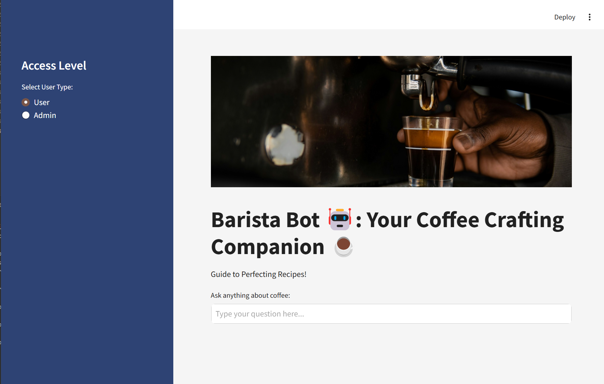

# Multimodal RAG
Overview:<br>
Barista Bot is a chatbot that can answer questions about the menu and train baristas on the coffee recipes.

## Tech Stack
<table>
    <tr>
        <th>Frontend</th>
        <th>Backend</th>
        <th>LLM</th>
        <th>Vector Database</th>
    </tr>
    <tr>
        <td>Streamlit</td>
        <td>FastAPI</td>
        <td>Hermes-Llama-3.2-3b-instruct</td>
        <td>ChromaDB</td>
    </tr>
</table>

## App Setup
### Git clone
```bash
git clone https://github.com/SID-SURANGE/AI-Sandbox.git
```

### Navigate to the app directory
```bash
cd AI-Sandbox/source_codes/MM-RAG
```

### Install dependencies
```bash
pip install -r requirements.txt
```

## Add Data
Upload data to `data/` folder. 
Supported formats: PDF, TXT, DOCX.
Future support for images and video formats.

## Run App
### Running UI
```
streamlit run src/ui.py
```

### Start FastAPI server
```
python main.py
```

### Running the models locally
1. Open LM Studio and download the hermes-llama-3.2-3b-instruct model or any other model of your choice.
2. Open the `src/model.py` file and set the `model_name` to `hermes-llama-3.2-3b-instruct`.
3. Run the server on LM Studio to serve the model locally.

## UI Screenshots


## First Run
Populate the vector database by uploading data to `data/` folder.
Below are the steps to do so:
1. By default when app loads, it will be in USER mode.
2. On the UI, select Admin mode and add correct credentials (Password: `pass1234`).
3. Once approved, upload the required files from the upload section.
4. Once uploaded, the data will be processed and stored in the vector database.
5. Once the data is processed, you can query the data using the search bar.

For subsequent runs, you can skip the admin mode and directly upload the data in USER mode.


